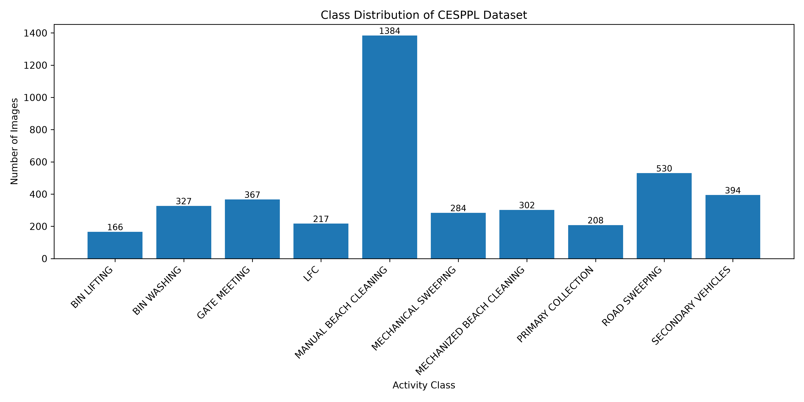
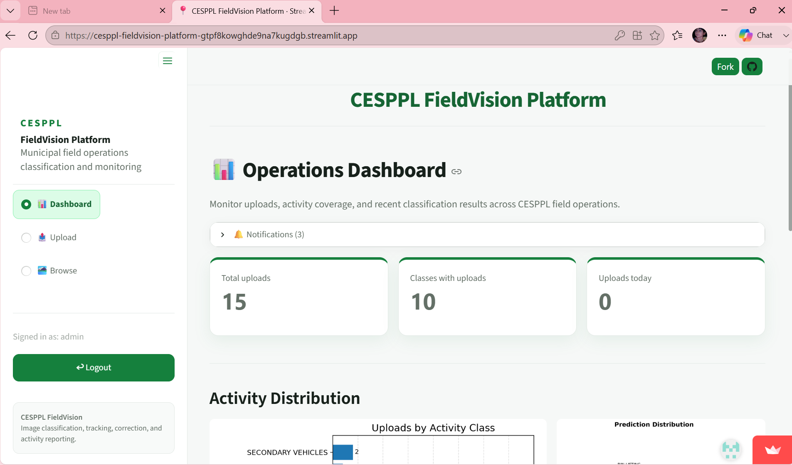

# CESPPL FieldVision Platform

## Final Project Report

## Executive Summary

The CESPPL FieldVision Platform is an AI-powered web application developed to automate the classification and management of municipal field-operation images. The project addresses the challenge of manually sorting and monitoring large numbers of operational photographs collected during sanitation and maintenance activities.

A dataset containing 4,179 raw field images across ten operational classes was prepared through validation, preprocessing, duplicate removal, and stratified splitting. After identical-image deduplication, 3,616 processed images were used for model development. An EfficientNetB0 transfer-learning model was trained and achieved a final test accuracy of **95.03%**, a **macro F1-score of 93.20%**, and a best validation accuracy of **95.58%**.

The trained model was integrated into a Streamlit-based platform with image upload, AI prediction, SQLite storage, dashboard analytics, image browsing, and report-generation capabilities, providing an efficient decision-support system for municipal field operations.

## Problem Statement

Municipal field teams capture thousands of photographs representing activities such as road sweeping, bin washing, beach cleaning, and waste collection. Manually organizing and reviewing these images is time-consuming, inconsistent, and difficult to scale.

The objective of this project is to automatically classify uploaded field-operation images using deep learning while providing an easy-to-use dashboard for monitoring uploads, reviewing predictions, browsing records, and generating reports.

## Dataset

The dataset consists of real municipal field-operation photographs collected across ten activity classes.

### Dataset Summary

- Raw Images: **4,179**
- Processed Images After Deduplication: **3,616**
- Number of Classes: **10**
- Train/Validation/Test Split: **70% / 15% / 15%**

### Class Distribution

The dataset is naturally imbalanced. MANUAL BEACH CLEANING is the largest class, while BIN LIFTING and PRIMARY COLLECTION contain fewer samples.

## Methodology

The project followed a complete machine-learning workflow:

- Dataset inventory and validation
- EXIF correction
- Image resizing and centre cropping
- RGB conversion
- Duplicate-image removal
- Stratified train/validation/test split
- Transfer learning using EfficientNetB0
- Model evaluation and final model selection
- Streamlit deployment with SQLite database integration

## Results

### Overall Performance

| Metric | Value |
|---------|------:|
| Best Validation Accuracy | 95.58% |
| Final Test Accuracy | 95.03% |
| Macro F1-Score | 93.20% |

### Per-Class Performance

|         class              | Precision   | Recall    | F1-score    | Support |
|---                         |---:         |---:       |---:         |---:     |
| BIN LIFTING                | 1.0000      | 1.0000    | 1.0000      | 25      |
| BIN WASHING                | 0.9231      | 0.9796    | 0.9505      | 49      |
| GATE MEETING               | 0.9623      | 0.9444    | 0.9533      | 54      |
| LFC                        | 0.8750      | 0.7000    | 0.7778      | 20      |
| MANUAL BEACH CLEANING      | 0.9659      | 0.9950    | 0.9802      | 199     |
| MECHANICAL SWEEPING        | 1.0000      | 0.9259    | 0.9615      | 27      |
| MECHANIZED BEACH CLEANING  | 0.9677      | 0.9677    | 0.9677      | 31      |
| PRIMARY COLLECTION         | 0.8421      | 1.0000    | 0.9143      | 16      |
| ROAD SWEEPING              | 0.9231      | 0.9231    | 0.9231      | 78      |
| SECONDARY VEHICLES         | 0.9487      | 0.8409    | 0.8916      | 44      |

## Confusion Highlights

The confusion matrix indicates excellent performance across most classes. The most challenging activities were visually similar operations, including:

- LFC and ROAD SWEEPING
- LFC and MANUAL BEACH CLEANING
- ROAD SWEEPING and BIN WASHING
- ROAD SWEEPING and LFC
- SECONDARY VEHICLES and BIN WASHING
- SECONDARY VEHICLES and MANUAL BEACH CLEANING

These results suggest that similar backgrounds, machinery, and operational contexts can make classification more difficult.

## Error Analysis

The remaining prediction errors mainly occurred due to:

- Similar-looking operational activities
- Images captured from different distances
- Partial visibility of equipment
- Multiple activities appearing in a single image
- Class imbalance
- Similar vehicles and road environments

Increasing the diversity and quantity of training images for underrepresented classes could further improve performance.

## System Implementation

The CESPPL FieldVision Platform was developed as a complete AI-powered web application using Streamlit for the frontend and TensorFlow/Keras for deep learning inference.

The system workflow consists of:

- Image upload through the Streamlit interface
- Image preprocessing (RGB conversion, resizing, normalization)
- Prediction using the trained EfficientNetB0 model
- Storage of uploaded images and prediction records in a SQLite database
- Dashboard visualization of operational statistics
- Image browsing and search functionality
- Class reassignment for correcting predictions
- ZIP download support for reports and records

The platform provides administrators with a centralized dashboard for monitoring municipal field-operation activities.

### Dashboard

## Limitations

Although the platform achieved strong performance, several limitations remain:

- The dataset is naturally imbalanced, with some activities having significantly fewer samples.
- Certain activities share similar visual characteristics, making classification more challenging.
- The model has been evaluated only on the available CESPPL dataset and may require retraining for other organizations or environments.
- The current authentication system supports a single administrator.
- SQLite is appropriate for small-scale deployments but is not intended for large multi-user systems.
- When deployed on Streamlit Community Cloud, locally stored database records may not persist after application restarts.
- Predictions should support human decision-making and not replace manual verification for important operational records.

## Future Work

Potential improvements for future versions include:

- Retraining the model using corrected or reassigned uploads.
- Expanding the dataset with additional field-operation images.
- Implementing secure authentication with multiple user roles.
- Migrating from SQLite to a persistent cloud database.
- Adding continuous model monitoring and performance tracking.
- Improving the mobile experience for field personnel.
- Exploring advanced deep-learning architectures for even higher classification accuracy.

## Conclusion

The CESPPL FieldVision Platform demonstrates a complete end-to-end artificial intelligence workflow, beginning with raw image inventory and progressing through preprocessing, duplicate removal, model training, evaluation, deployment, and monitoring.

Using transfer learning with EfficientNetB0, the system achieved a final test accuracy of **95.03%** and a **macro F1-score of 93.20%** across ten municipal field-operation classes. The Streamlit application successfully integrates AI-powered image classification with dashboard analytics, image management, and operational reporting.

The project provides an effective decision-support tool for municipal field operations while also serving as a strong foundation for future enhancements such as cloud-based storage, multi-user support, and continuous model improvement.