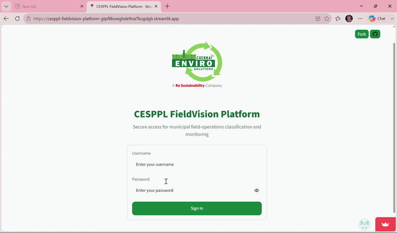
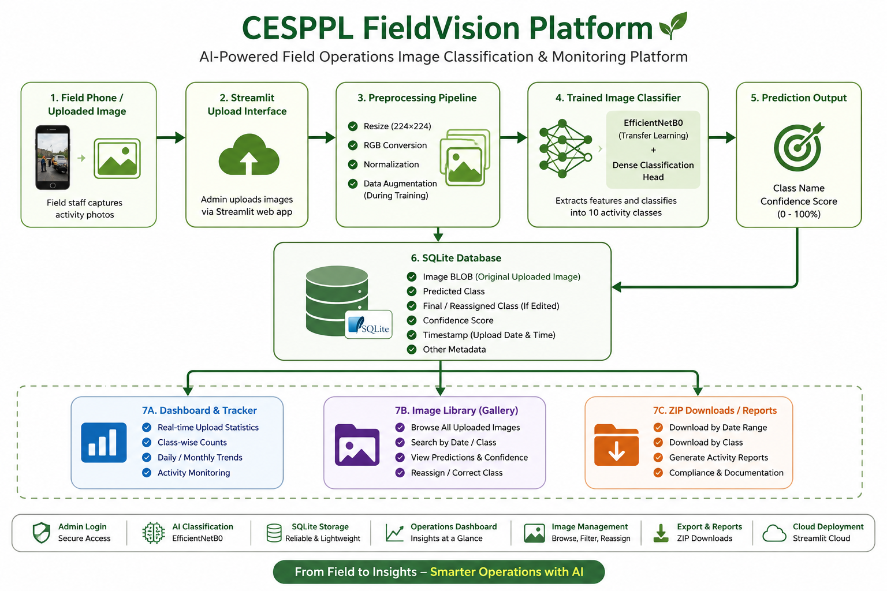

# 🌿 CESPPL FieldVision Platform

### AI-Powered Field Operations Image Classification & Monitoring Platform

CESPPL FieldVision Platform is an AI-powered web application developed to classify and monitor municipal field-operation activities using deep learning. The platform enables administrators to upload field images, automatically classify operational activities, manage upload records, visualize statistics, browse historical records, and generate downloadable reports through an interactive Streamlit dashboard.

## 🚀 Live Demo

- **🌐 Streamlit Application:** https://cesppl-fieldvision-platform-gtpf8kowghde9na7kugdgb.streamlit.app/
- **💻 GitHub Repository:** https://github.com/anuhya901-cell/cesppl-fieldvision-platform

## 🎥 Dashboard Demo



## 📌 Problem Statement

Municipal field-operation teams collect thousands of photographs representing activities such as road sweeping, beach cleaning, bin washing, and waste collection. Manual sorting, tracking, and reporting of these images is time-consuming and prone to inconsistency. The CESPPL FieldVision Platform automates image classification using deep learning while providing an integrated dashboard for monitoring uploads, browsing records, correcting classifications, and generating downloadable reports.

## 📊 Results at a Glance

- **Number of Classes:** 10
- **Raw Images:** 4,179
- **Processed Images After Deduplication:** 3,616
- **Best Validation Accuracy:** 95.40%
- **Final Test Accuracy:** 95.03%
- **Final Macro F1-Score:** 93.20%
- **Model Backbone:** EfficientNetB0
- **Deployment:** Streamlit Web Application  

## 🏗️ System Architecture

The CESPPL FieldVision Platform follows a complete end-to-end workflow, from field image acquisition to AI-based classification, database storage, dashboard visualization, and report generation.



The system captures field-operation images through a Streamlit interface, preprocesses them for inference, classifies them using an EfficientNetB0-based deep learning model, stores predictions in a SQLite database, and provides dashboards, image browsing, and downloadable reports for administrators.

## ✨ Key Features

- 🔐 Secure Admin Login
- 📤 Image Upload through Streamlit
- 🤖 AI-powered Image Classification
- 📈 Confidence Score Prediction
- 🗂️ SQLite Database Storage
- 📊 Dashboard with Upload Statistics
- 🖼️ Image Library & Gallery
- 📅 Date-based Filtering
- ✏️ Class Reassignment Support
- 📦 ZIP Download of Reports
- ☁️ Streamlit Cloud Deployment

## 🗂️ Dataset Classes

The model classifies the following municipal field-operation activities:

- BIN LIFTING
- BIN WASHING
- GATE MEETING
- LFC
- MANUAL BEACH CLEANING
- MECHANICAL SWEEPING
- MECHANIZED BEACH CLEANING
- PRIMARY COLLECTION
- ROAD SWEEPING
- SECONDARY VEHICLES

## 🚀 Quick Start

### 1. Clone the Repository

```bash
git clone https://github.com/anuhya901-cell/cesppl-fieldvision-platform.git
cd cesppl-fieldvision-platform
```

### 2. Create a Virtual Environment

```bash
python -m venv .venv
```

**Windows PowerShell**

```powershell
.\.venv\Scripts\Activate.ps1
```

### 3. Install Dependencies

```bash
pip install -r requirements.txt
```

### 4. Run the Application

```bash
streamlit run app.py
```

**Recommended Python Version:** 3.11

## 📚 Documentation

- [Model Card](MODEL_CARD.md)
- [Data Card](DATA_CARD.md)
- [Dashboard Specification](DASHBOARD_SPEC.md)
- [Final Report](FINAL_REPORT.md)
- [Class Definitions](CLASSES.md)

## ☁️ Deployment and Data Persistence

The application uses SQLite for local upload tracking and management. When deployed on Streamlit Community Cloud, the SQLite database is created at runtime. Since the Streamlit Community Cloud filesystem is temporary, locally stored records may be reset after application restarts or redeployments. For production deployments, a persistent cloud database is recommended.

## 🚀 Future Work

- Retrain the model using corrected or reassigned uploads.
- Strengthen authentication and user management.
- Support multiple user roles.
- Integrate a persistent cloud database.
- Collect more diverse and balanced field-operation images.
- Improve the mobile experience for field personnel.
- Add continuous model monitoring and performance tracking.